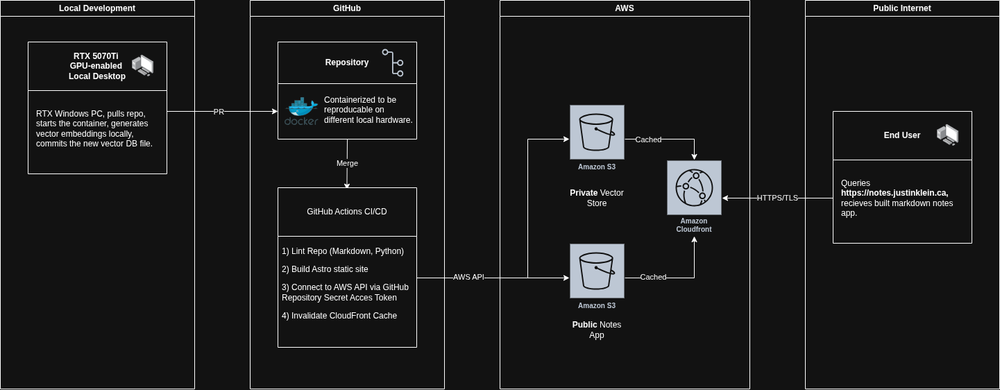

# My Tech Notes App - SSG Markdown Site
## Author: Justin Klein
### Last Updated: January 8th, 2026

### Description:
**Astro** site that hosts all notes on my personal technical experience - from leveraged frameworks, certification preparation and relevant past professional experience. Also includes a **Python** script to generate **vector embeddings** to be leveraged via a **RAG** process in [secure-study-agent](https://github.com/justinklein2001/secure-study-agent). **Terraform** is leveraged to provision both the site and the vector store securely in **AWS S3**.

### Architecture:

### Infrastructure & Security:
Leverage **Terraform** to provision both **S3** buckets and **IAM** application accounts leveraging the **Principle of Least Privilege**.