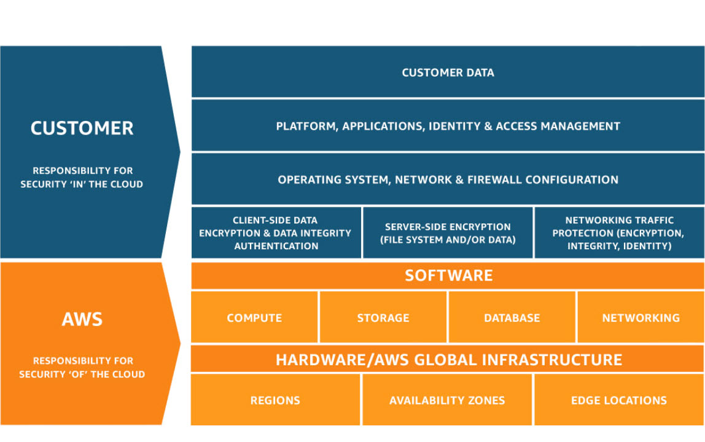

- **Compute** services include **EC2**, **Lambda** and **Elastic Beanstalk**, among others.
- **Storage** services include **S3**, **Glacier**
- **Security** services include **Identity and Access Managed (IAM)** and **AWS Organizations**.
- **Cost Management** services help you track the costs of your AWS solutions.
- The new **IoT** services will get their own exam in the future. 

### Shared Responsibility Model

[Image Source: AWS](https://aws.amazon.com/compliance/shared-responsibility-model/)

### Regions and Availability Zones

**Region**: **Physical location** or boundary with AWS data centers.

**Availability Zone**: **1-6** zones with redundant power and network, with **multiple zones** within a **region**. 